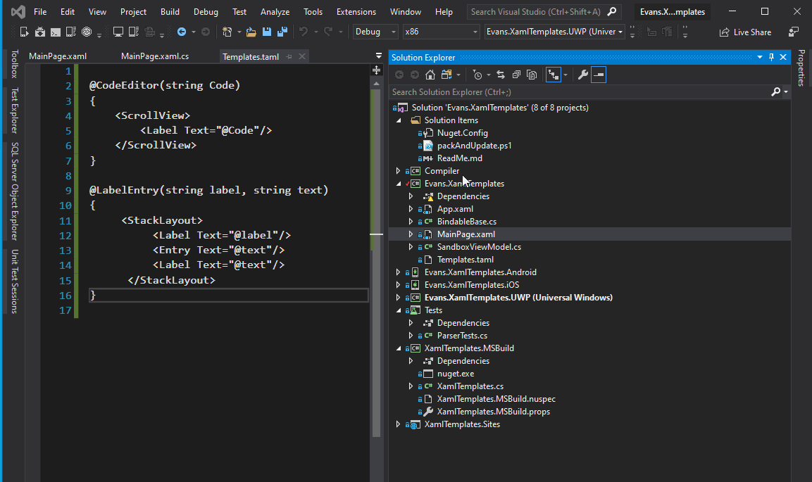
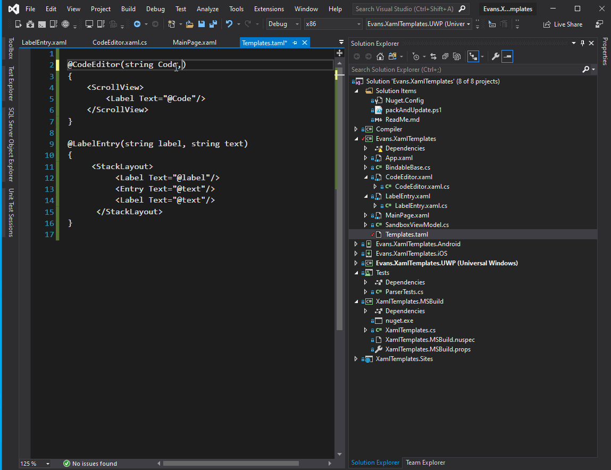
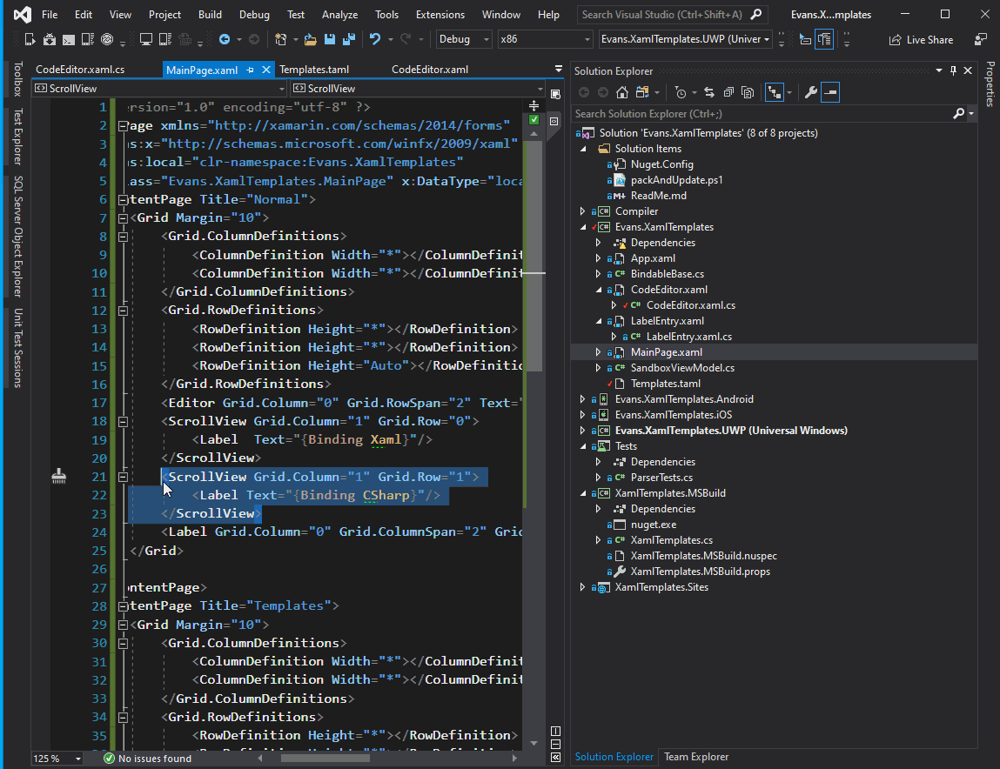

# Xaml Templates (Work in Progress)
**This project is not production ready and just shows how a template system for xaml could work**

## Reasoning (Why does this exist?)
- Better reuse of components
- Inspired by the razor engine in asp.net core.
- Write less code!
- Mix C# and xaml to generate your view (think razor)
- Compatible with current xaml projects.
  - Use as much or as little templates as needed  

Additionally, I really **hate** writing 
```xml
<StackLayout>
    <Label Text="First Name"/>
    <Entry Text="{Binding FirstName}"/>
    <Label Text="Last Name"/>
    <Entry Text="{Binding LastName}"/>
    <Label Text="Age"/>
    <Entry Text="{Binding Age}"/>
</StackLayout>
``` 
over and over again

I'd rather write this:

```xml
<local:Entry Caption="First Name" Text="{Binding FirstName}"/>
<local:Entry Caption="Last Name" Text="{Binding LastName}"/>
<local:Entry Caption="Age" Text="{Binding Age}"/>
```

We can do this by writing this in our Templates.taml file:

```csharp
@Entry(string Caption, string Text)
{
    <StackLayout>
        <Label Text="@Caption"/>
        <Entry Text="@Text"/>        
    </StackLayout>
}
```

This will generate the desired control as seen above

## How it works
1. Install the XamlTemplates.MSBuild nuget to your Xamarin.Forms .net standard project
2. Create a file called ```Templates.taml```
3. Add the following code ```@HelloLabel() { <Label Text="Hello World!"/> } ```
4. Build the project
5. This should generate ```HelloLabel.xaml``` and ```HelloLabel.xaml.cs```
6. You can now use this template in you xaml like so:  ```<local:HelloLabel/>```


Xaml templates is a templating engine for xamarin forms that allows you to build templates with ease without having to make custom controls.

**Turn 40+ lines of code to just 8**

## Examples
Below is an example of a template in a file called template.taml

**Easily use templates in your xaml app**

**Easy to add and update templates, which update the project on build**




### Basic Example

```csharp
@LabelEntry(string label,string Text)
{
	<StackLayout>
		<Label Text="@label"/>
		<Entry Text="@Text"/>
	</StackLayout>
}
```
#### Result
This will be generated to the following c# and xaml file

LabelEntry.xaml
```xml
<?xml version="1.0" encoding="UTF-8"?>
<ContentView xmlns="http://xamarin.com/schemas/2014/forms" 
             xmlns:x="http://schemas.microsoft.com/winfx/2009/xaml"
             xmlns:d="http://xamarin.com/schemas/2014/forms/design"
             xmlns:mc="http://schemas.openxmlformats.org/markup-compatibility/2006"
             mc:Ignorable="d"
             x:Class="Evans.XamlTemplates.LabelEntry">
  <ContentView.Content>
      <StackLayout>
          <Label x:Name="_Label"/>
          <Entry x:Name="_Entry"/>
      </StackLayout>
    </ContentView.Content>
</ContentView>
```

LabelEntry.xaml.cs
```csharp
using Xamarin.Forms;
using Xamarin.Forms.Xaml;

namespace Evans.XamlTemplates
{
    [XamlCompilation(XamlCompilationOptions.Compile)]
    public partial class LabelEntry : ContentView
    {
        public static BindableProperty labelProperty = 
            BindableProperty.Create(nameof(label), typeof(string), typeof(LabelEntry), default, BindingMode.TwoWay);
        public static BindableProperty TextProperty = 
            BindableProperty.Create(nameof(Text), typeof(string), typeof(LabelEntry), default, BindingMode.TwoWay);
        public LabelEntry()
        {
            InitializeComponent();
            _Label.BindingContext = this;
            _Entry.BindingContext = this;
            _Label.SetBinding(Label.TextProperty,nameof(label));
            _Entry.SetBinding(Entry.TextProperty, nameof(Text));
        }
        public string label
        {
            get => (string)GetValue(LabelProperty);
            set => SetValue(LabelProperty, value);
        }
        public string Text
        {
            get => (string)GetValue(TextProperty);
            set => SetValue(TextProperty, value);
        } 
    }
}
```

### More Advanced Example

```csharp
@EntryAndPicker(string Label,string Text, IEnumerable<string> data, string selectedItem)
{
<StackLayout>
    <Label Text="@Label"/>
    <Entry Text="@Text"/>
    <Label Text="Result:"/>
    <Label Text="@Text"/>
    <Picker ItemsSource="@data" SelectedItem="@selectedItem"/>
    <Label Text="@selectedItem"/>
</StackLayout>
}
```
#### Result

```xml
<?xml version="1.0" encoding="UTF-8"?>
<ContentView xmlns="http://xamarin.com/schemas/2014/forms" 
             xmlns:x="http://schemas.microsoft.com/winfx/2009/xaml"
             xmlns:d="http://xamarin.com/schemas/2014/forms/design"
             xmlns:mc="http://schemas.openxmlformats.org/markup-compatibility/2006"
             mc:Ignorable="d"
             x:Class="Evans.XamlTemplates.EntryAndPicker">
  <ContentView.Content>
      <StackLayout>
          <Label x:Name="_Label" />
          <Entry x:Name="_Entry" />
          <Label Text="Result:"/>
          <Label x:Name="_Label1" />
          <Picker x:Name="_Picker" />
          <Label x:Name="_Label2" />
      </StackLayout>
    </ContentView.Content>
</ContentView>
```


```csharp
using System;
using System.Collections.Generic;
using System.Linq;
using System.Text;
using System.Threading.Tasks;
using Xamarin.Forms;
using Xamarin.Forms.Xaml;

namespace Evans.XamlTemplates
{
    [XamlCompilation(XamlCompilationOptions.Compile)]
    public partial class EntryAndPicker : ContentView
    {
        public static BindableProperty LabelProperty =
            BindableProperty.Create(nameof(Label), typeof(string), typeof(EntryAndPicker), default, BindingMode.TwoWay);
        public static BindableProperty TextProperty =
            BindableProperty.Create(nameof(Text), typeof(string), typeof(EntryAndPicker), default, BindingMode.TwoWay);

        public static BindableProperty dataProperty =
            BindableProperty.Create(nameof(data), typeof(IEnumerable<string>), typeof(EntryAndPicker), default, BindingMode.TwoWay);
        public static BindableProperty selectedItemProperty =
            BindableProperty.Create(nameof(selectedItem), typeof(string), typeof(EntryAndPicker), default, BindingMode.TwoWay);

        public EntryAndPicker()
        {
            InitializeComponent();
            _Label.BindingContext = this;
            _Entry.BindingContext = this;
            _Label1.BindingContext = this;
            _Picker.BindingContext = this;
            _Label2.BindingContext = this;
            _Label.SetBinding(Xamarin.Forms.Label.TextProperty, nameof(Label));
            _Entry.SetBinding(Xamarin.Forms.Entry.TextProperty,nameof(Text));
            _Label1.SetBinding(Xamarin.Forms.Label.TextProperty, nameof(Text));
            _Picker.SetBinding(Xamarin.Forms.Picker.ItemsSourceProperty, nameof(data));
            _Picker.SetBinding(Xamarin.Forms.Picker.SelectedItemProperty, nameof(selectedItem));
            _Label2.SetBinding(Xamarin.Forms.Label.TextProperty, nameof(selectedItem));
        }

        public string Label
        {
            get => (string)GetValue(LabelProperty);
            set => SetValue(LabelProperty, value);
        }
        public string Text
        {
            get => (string)GetValue(TextProperty);
            set => SetValue(TextProperty, value);
        }

        public IEnumerable<string> data
        {
            get => (IEnumerable<string>)GetValue(dataProperty);
            set => SetValue(dataProperty, value);
        }
        public string selectedItem
        {
            get => (string)GetValue(selectedItemProperty);
            set => SetValue(selectedItemProperty, value);
        }
    }
}

```

Notice how much code it takes to just make a template?  There needs to be a simpler solution

# Analysis

## What needs to be known?

- ClassName
- Parameters (Comma Seperated)
  - Name of Parameter
  - Type of Parameter
- Controls With Bindings
  - Control Type
  - Control name (Label1, label2, etc...)
  - Bindings on control
    - Control Type
    - Control Property
    - Bindable Property

## Logic
```csharp
foreach parameter
  - create a bindable property
  - create a property
foreach control
  - Set binding context to this
  foreach binding on control
    - set binding for control
```

# Resources

## Useful Scripts
In the msbuild task  
```.\nuget.exe pack .\XamlTemplates.MSBuild.nuspec```  
You can then add the package using the following command:  
```dotnet add package XamlTemplates.MSBuild```  
**Note: this works because Nuget.config defines a custom location for the nuget packages**

- Based off my compilers project
- creating an msbuild task:
  - https://blog.rsuter.com/implement-custom-msbuild-tasks-and-distribute-them-via-nuget/